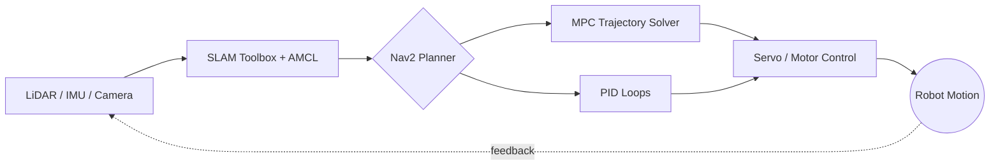

<h1 align="center">Deepak K</h1>
<h3 align="center">EEE Student · Building robots that sense, decide, and move</h3>

<p align="center">
  <a href="https://deepxk.vercel.app">Portfolio</a> ·
  <a href="mailto:deeeps06@gmail.com">Email</a> ·
  <a href="https://github.com/Deepakk-06">GitHub</a>
</p>

```
$ ros2 launch deepak_bringup system_check.launch.py

[boot] EEE undergrad, robotics stack initializing...
[sensors]      RPLiDAR A1 ................... OK   (12m range, 360°)
[sensors]      IMU (6-axis) .................. OK   (drift-compensated)
[sensors]      camera + YOLOv8 ............... OK   (real-time inference)
[localization] SLAM Toolbox + AMCL ........... LOCKED
[planning]     Nav2 costmap .................. LOADED
[planning]     MPC trajectory solver ......... CONVERGED   (obstacle-aware)
[actuation]    18x STS3215 servos ............ SYNCED   (6 legs, 3 joints/leg)
[actuation]    PID line-follow loop .......... TUNED   (Kp/Ki/Kd optimized)
[deploy]       Gazebo sim -> real hardware ... CONFIRMED
[status]       4/5 systems running on physical hardware, not just rviz

> mission: turn "it works in sim" into "it works on the table in front of you"
```

That's not decoration — that's roughly what's actually running across the five projects below. Sense → decide → move, on real hardware, with real failure modes solved along the way.



---

### Featured Builds

**[Hexapod-6](https://github.com/Deepakk-06/hexapod-6)** — 18-DOF hexapod
Custom inverse kinematics and gait generation driving 18 STS3215 servos across 6 legs, running on a Jetson Orin Nano. The hard part wasn't the math — it was calibration drift across 18 joints and making the gait stay stable when one leg's servo lags.
`ROS 2` `Python` `IK` `STS3215` `Jetson Orin Nano`

**[Sentinel SLAM Robot](https://github.com/Deepakk-06/SENTINEL-SLAM)** — SLAM, sim to real
Built and tuned in Gazebo, then actually deployed onto a Raspberry Pi 4 with LiDAR + IMU — the step most student projects skip. Covers mapping, localization, and Nav2-based navigation on real hardware, not just a rosbag replay.
`ROS 2` `Gazebo` `Nav2` `SLAM Toolbox` `Raspberry Pi 4`

**[ROS2 Model Predictive Control](https://github.com/Deepakk-06/ROS2-Model-Predictive-Control-)** — smoother-than-PID navigation
An MPC framework for trajectory tracking that plans around obstacles instead of just reacting to them — built to compare directly against a standard PID/pure-pursuit baseline.
`Python` `ROS 2` `Control Theory`

**[Soil Grain Detection Mapping](https://github.com/Deepakk-06/Soil-Grain-Detection-Mapping)** — YOLO outside the usual domains
A YOLO + OpenCV pipeline repurposed for granular particle detection, with spatial analysis and visualization — proof that the detection pipeline generalizes past "cats and cars."
`Python` `YOLO` `OpenCV`

**[PID Line Following Robot](https://github.com/Deepakk-06/PID-Line-Following-Robot)** — where the control-theory habit started
IR-sensor line following with a tuned PID loop, optimized for speed on tight turns rather than just staying on the line.
`Arduino` `C` `Embedded C`

---

### By the numbers

| | |
|---|---|
| **18** | servos synchronized on one hexapod gait cycle |
| **6** | legs, 3 joints each, custom IK solved for every step |
| **1** | SLAM stack taken all the way from Gazebo to a Raspberry Pi 4 in the field |
| **2** | control strategies compared head-to-head (PID vs. MPC) on the same nav problem |
| **0** | of these projects stopped at "runs in simulation" |

---

### See it move

*(This is the section that actually convinces people — a 10–15s clip beats any badge.)*

<!-- Swap these for real GIFs once recorded, e.g.: -->
<!--  -->
<!--  -->

- 🦿 Hexapod-6 walking on 18 synced servos → *(GIF pending)*
- 🗺️ Sentinel SLAM building a live map on the RPi4 → *(GIF pending)*
- 🎯 MPC vs. PID trajectory comparison, side by side → *(GIF pending)*

---

### Stack

| Robotics | Control | Embedded | Vision |
|---|---|---|---|
| ROS 2, Gazebo, RViz, Nav2 | PID | ESP32, micro-ROS | OpenCV |
| SLAM Toolbox, AMCL, TF2 | Model Predictive Control | Arduino (C / Embedded C) | YOLO |
| | Trajectory tracking, kinematics | Serial comms, motor control | Image processing / detection pipelines |

**Languages:** Python, C, Embedded C, Arduino
**Tools:** Git/GitHub, Linux, CAD, KiCad, EasyEDA

*(No C++ yet — control code is Python-side, embedded side is C/Arduino.)*

---

### Right now

Moving from "code repo" to "working engineering proof" — better demo videos, cleaner docs per project, and full end-to-end systems that hold up on real hardware, not just in simulation.

---

<p align="center">
<a href="https://deepxk.vercel.app">deepxk.vercel.app</a> · <a href="mailto:deeeps06@gmail.com">deeeps06@gmail.com</a>
</p>MPC framework for smooth trajectory tracking and obstacle-aware navigation.
`Python` `ROS 2` `Control Theory`

</td>
<td width="50%">

**🌾 [Soil Grain Detection Mapping](https://github.com/Deepakk-06/Soil-Grain-Detection-Mapping)**
YOLO-based particle detection with spatial analysis + visualization.
`YOLO` `OpenCV` `Python`

</td>
</tr>
<tr>
<td colspan="2">

**⚡ [PID Line Following Robot](https://github.com/Deepakk-06/PID-Line-Following-Robot)**
High-speed IR line-following with tuned PID — because slow robots are boring.
`Arduino` `C` `Embedded`

</td>
</tr>
</table>

---

### 🛠️ Tech Arsenal

<p align="center">
  
</p>

**Robotics:** ROS 2 · Gazebo · RViz · Nav2 · SLAM Toolbox · AMCL · TF2
**Control:** PID · Model Predictive Control · Trajectory Tracking · Kinematics
**Embedded:** ESP32 · micro-ROS · Serial Comm · Sensors · Motor Control
**Vision:** OpenCV · YOLO · Image Processing · Detection Pipelines

---

### 📊 The Stats Don't Lie

<p align="center">
  
  
</p>

<p align="center">
  
</p>

<p align="center">
  
</p>

---

### 🎯 Current Focus

> Turning code repos into **working engineering proof** — stronger demo evidence, cleaner docs, and complete end-to-end robot systems that don't just run in simulation, but survive contact with the real world.

---

<h3 align="center">📡 Let's connect and build something that moves</h3>

<p align="center">
  <a href="https://deepxk.vercel.app"></a>
  <a href="mailto:deeeps06@gmail.com"></a>
</p>

<p align="center"><i>Currently building something huge, one control loop at a time. ⚙️</i></p>
