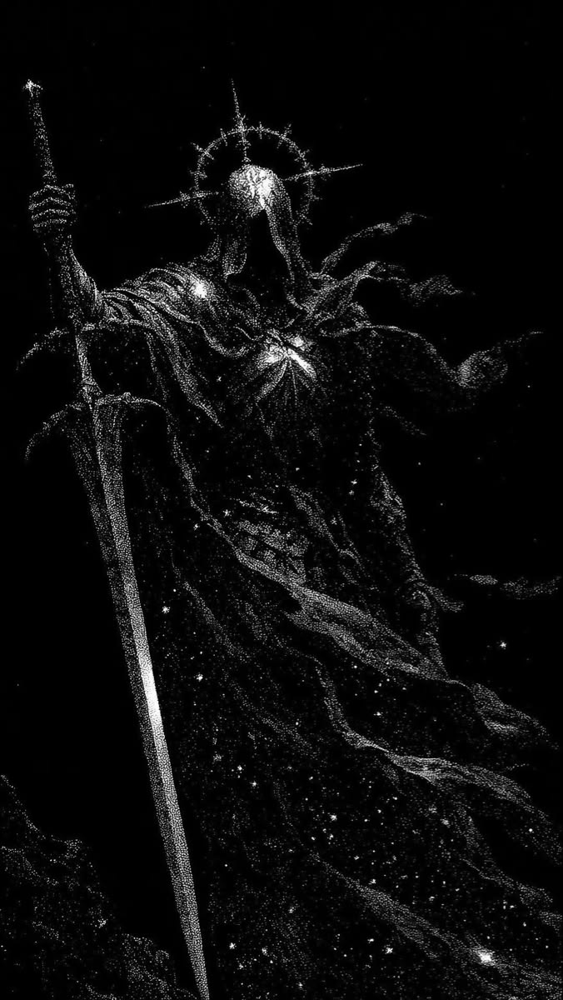

  

<h1 align="center">deepAk . main character energy, side character sleep schedule.</h1>

  

<h3 align="center">Geek · Embedded Systems · VLA Research</h3>

  

  Building robots that survive contact with real hardware.

<h2 align="center">🤖 About Me</h2>

Final-year **EEE** student building robots that deal with the messy parts — noisy sensors, drift, latency, hardware that refuses to behave.

I work across **SLAM-based mobile robots, legged robots, and manipulator arms**, and I'm currently researching whether **domain randomization improves generalization in VLA (Vision-Language-Action) models**, using OpenVLA in Isaac Sim.

Simulation is the starting point — hardware is the real test. I'd rather ship something that works on a bench full of loose wires than something that only works in a clean simulator.

 

<h2 align="center">🤝 Connect</h2>

  
  &nbsp;
  
  &nbsp;
  
  &nbsp;
  

<h2 align="center">🚀 Featured Projects</h2>

| Project | What it is |
| --- | --- |
| 🕷️ [**hexapod-6**](https://github.com/Deepakk-06/hexapod-6) | Six-legged autonomous robot combining Jetson high-level compute with STM32 real-time servo control, running ROS 2 for LiDAR SLAM and coordinated gait control |
| 🛰️ [**SENTINEL-SLAM**](https://github.com/Deepakk-06/SENTINEL-SLAM) | Autonomous ROS 2 rover with LiDAR SLAM, Nav2 navigation, and real-time monocular depth estimation (Depth Anything V2) streamed from a Pi to a GPU host |
| 🎯 [**ROS2 MPC Navigation**](https://github.com/Deepakk-06/ROS2-Model-Predictive-Control-) | ROS 2 Model Predictive Control framework for autonomous robot navigation: trajectory tracking, path smoothing and real-time obstacle handling |
| 🚫🌿 [**skill-match (Branchless)**](https://github.com/Deepakk-06/skill-match) | A skill-first hiring platform that looks beyond degree branches and matches students through skills, projects and real evidence |
| 🌱 [**Soil Grain Detection**](https://github.com/Deepakk-06/Soil-Grain-Detection-Mapping) | YOLO-based soil grain detection and mapping, with edge deployment for real-time soil assessment |
| ⚛️ [**quantum_research**](https://github.com/Deepakk-06/quantum_research) | Conceptual research study on QUBO and QAOA for traffic-aware path planning in autonomous delivery robots |
| 🕹️ [**personal-portfolio**](https://github.com/Deepakk-06/personal-portfolio) | Retro-arcade portfolio with a Pong loader, 3D avatar and live listening card |

<h2 align="center">🧠 Languages</h2>

  
  
  

<h2 align="center">🔩 Single-Board Computers</h2>

  
  

<h2 align="center">🔌 Microcontrollers</h2>

  
  
  

<h2 align="center">💻 Frameworks & Tools</h2>

  
  
  
  
  
  

<h2 align="center">🔧 Currently Building</h2>

SENTINEL (quadruped AMR, LiDAR SLAM) &nbsp;·&nbsp; Hexapod on STS3215 servos &nbsp;·&nbsp; SO-101 follower arm &nbsp;·&nbsp; STM32-based embedded control &nbsp;·&nbsp; currently researching OpenVLA + domain randomization

<h2 align="center">📊 GitHub Stats</h2>

  

<h2 align="center">⌘ Commit Activity</h2>

<picture>
  <source media="(prefers-color-scheme: dark)"
    srcset="https://raw.githubusercontent.com/Deepakk-06/Deepakk-06/output/pacman-contribution-graph-dark.svg">
  <source media="(prefers-color-scheme: light)"
    srcset="https://raw.githubusercontent.com/Deepakk-06/Deepakk-06/output/pacman-contribution-graph.svg">
  

    
  

</picture>
